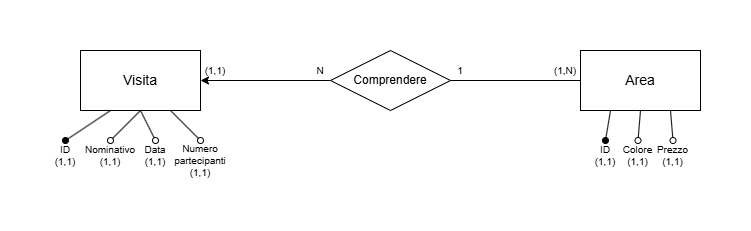

# Museo
Applicazione "Museo" - Esempio didattico Servlet in Java

## Funzionalità
- **Prenotazione di una visita**: specificando nome, data, area desiderata e numero di partecipanti.
- **Visualizzazione delle prenotazioni** con possibilità di filtrare per area.

## Tecnologie Utilizzate
Il progetto è stato realizzato con l'IDE IntelliJ IDEA Ultimate utilizzando:
- **Oracle OpenJKD 11** (Java 11)
- **Applicazione JavaEE 8**
- **Java Servlet**
- **Apache Tomcat**
- **Database MariaDB**

## Struttura del Progetto

### Servlet
- `PrenotaServlet`: Gestisce l'inserimento di nuove prenotazioni con validazione dei dati e controllo disponibilità.
- `VisualizzaServlet`:  Mostra l'elenco delle prenotazioni, con filtro opzionale per area.

### Pagine JSP
- `index.jsp`: Homepage.
- `prenota.jsp`: Form per l'inserimento di una nuova prenotazione.
- `esito-prenotazione.jsp`: Pagina di conferma/errore dopo la prenotazione.

### Classi di Supporto
- `ValidazioneEsiti`: Libreria di enum per i codici di errore delle validazioni.
- `DbUtility` (Libreria in formato JAR): Semplifica la gestione delle credenziali per l'accesso al DB tra l'ambiente di sviluppo e l'ambiente di produzione.

## Database
Di seguito il modello E/R del DB utilizzato dall'applicazione.

## Autore
**Lorenzo Porta**
Classe 5FIN, Anno scolastico 2025/2026 
ITT "G. Fauser" – Novara, Italia
